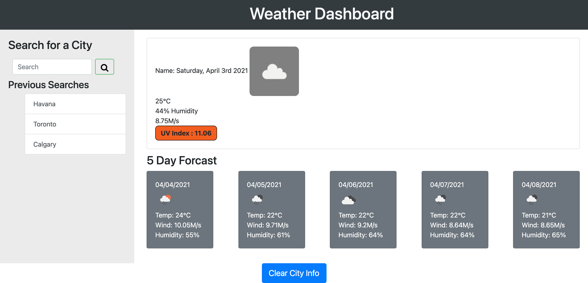

# Weather Dashboard API

## Purpose
A website that displays the weather for a user searched city.

## Built With
* HTML
* CSS
* JS
* Jquery
* Bootstrap
* Moment JS

## Website
https://missaimeejay.github.io/WeatherDashboardAPI/
Repository URL : https://github.com/MissAimeeJay/WeatherDashboardAPI

## Contribution
Made with ❤️ by Trilogy, openWeatherAPI & Aimee Jesso

### ©️2021

###  Credit
Search icon
https://www.iconfinder.com/icons/1608826/search_icon

Local Storage Refresher
https://developer.mozilla.org/en-US/docs/Web/API/Window/localStorage

Based UV Color Index on a different weather legend
https://www.theweathernetwork.com/ca/forecasts/uv/ontario/toronto

Open Weather Map
https://openweathermap.org/
